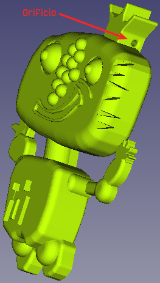
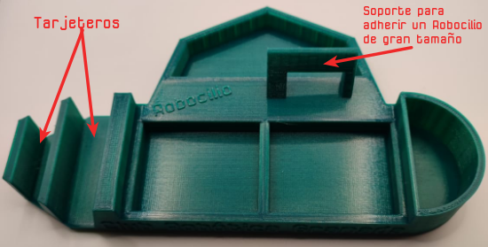
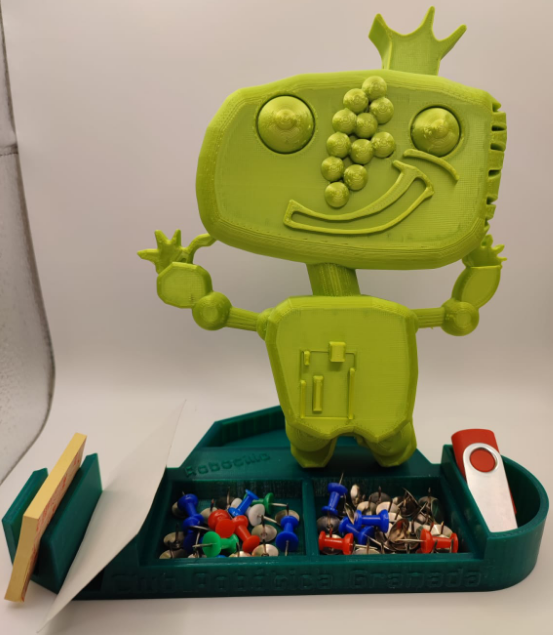

# Actualización de Robocilio
La modificación del orificio para colocar una anilla y convertir a Robocilio en un llavero se basa en el trabajo original publicado en:

* [Modelo 3D de Robocilio en repo de Fede Coca](https://github.com/fgcoca/Robocilio-3D)

* [Modelo 3D de Robocilio en repo de Club Robótica Granada](https://github.com/clubroboticagranada/Robocilio-3D)

A continuación están los enlaces a los archivos stl en diferentes tamaños.

| 55 mm | 60 mm | 100 mm | 170 mm | 196 mm |
|:|:|:|:|:|
|[55 mm](indice/Robocilio-55.stl) |[60 mm](indice/Robocilio-60.stl) | [100 mm](indice/Robocilio-100.stl) |[170 mm](indice/Robocilio-170.stl) |[196 mm](indice/Robocilio-196.stl) |

Los tamaños anteriores se han optimizado para las impresoras Prusa Original MK3S+ y Mini+.

En la imagen siguiente vemos una imagen del aspecto del nuevo Robocilio.

| Nuevo Robocilio con detalle del orificio para anilla |
|:|
|  |

El objeto de escritorio es de nueva creación y tiene el aspecto que vemos en la imagen siguiente:

| Aspecto del objeto de escritorio |
|:|
|  |

A continuación están los enlaces al fichero fuente y al stl generado.

| Archivo fuente FreeCAD | Archivo stl |
|:|:|
|[Archivo fuente FreeCAD](./img/indice/tarjetero.FCStd) |[Archivo stl](./img/indice/tarjetero.stl)

El aspecto final del montaje es el de la imagen siguiente.

| Aspecto del objeto de escritorio finalizado|
|:|
|  |

